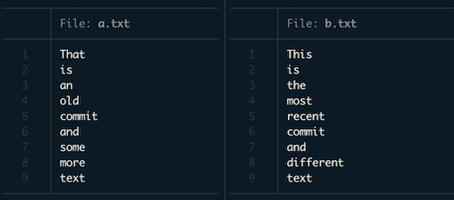
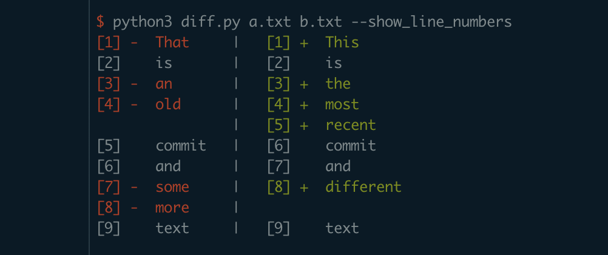

# Diffing Tool

Diffing tools show you what changed between two versions of a file.
For example, given these two input files:



The diff between them would show you what changed:



You probably know this from code review tools, e.g. the one from GitHub.
I decided to implement my own diffing tool for fun. :)

## Usage

To show the diff between `file1` and `file2`:

```sh
$ python3 diff.py file1.txt file2.txt
```

There are several optional flags:

| Flag                  | Description                              | Default                   |
| :---------------------|:-----------------------------------------|:-------------------------|
| `--unified_view`      | Whether to show a unfiied or split view. | The split view is shown. |
| `--show_line_numbers` | If set, line numbers are shown.          | Line numbers are hidden. |

## Algorithm

What's kinda cool about this tool is that it's an *optimal* diffing implementation,
meaning it always shows the smallest possible number of removal and addition markers.

This is done by computing the *longest common subsequence* for the unchanged parts, i.e.
we maximize the length of the unchanged parts. We implement that using dynamic programming,
with a quadratic complexity. In that recursion, we then also keep track of what is added and
removed.

## Potential improvements

There's some things left that could be improved:

- Actually packaging this into a tool that could be easily installed
- Side-by-side view with only removals on the left and only additions on the right.
  This would also make the line numbers more useful
- Char-based diffing as opposed to line-based diffing. The algorithm would stay
  exactly the same. The only thing that would need to be updated is the visualization
- Faster line-based diffing. One could first hash all lines to make comparisons faster
- Adding unit tests for stuff. I was lazy and just used [leetcode](https://leetcode.com/problems/longest-common-subsequence/)
 to test that the longest common subsequence algorithm is correct
